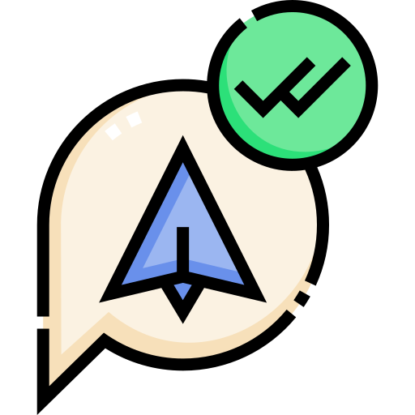

<div>
    <h1 align='center'> Avangers </h1>
    <br><br>
    </img>
    <br><br>
    <h3>Objetivo:</h3>
    <p>Este projeto tem como principal objetivo desenvolver o trabalho em equipe. E também servir de portfólio. A conclusão final é uma landing page, modelo escolhido por Eduardo e com informações sobre os Avangers, tema escolhido por Samuel.</p>
</div>

Data de conclusão: 3/12/2021<br><br>
## Ferramentas e tecnologias usadas nesse projeto.
 
```js
function Avangers(Project) {
    if (Front End) {
        const Stack = `${HTML}, ${CSS}`;
};
```
<br>

<div align="center">


</div>

<br><br>

---
<div>
    <h1 align="center">Desenvolvedores do Projeto</h1>
    <p align="center">Um dia seremos a própria tecnologia. Biohacking a própria evolução de nós mesmos.</p>
    <p align="center">Nos siga nas redes sociais</p>
    <br>
    <div>
        <div>
            <p style="font-size: 20px" align="center">Eduardo Kayke <a href="https://web.telegram.org/z/#-1582796052" target='_blank'></a> <a href="https://linkedin.com/in/eduardokaykedasilva" target="blank"></a> 
            <a href="https://github.com/EduardoKayke" target="blank"></a></p>
        </div>
        <div>
            <p align="center" style="font-size: 20px">Samuel Duraes <a href="https://web.telegram.org/z/#-575140342" target='_blank'></a> <a href="https://www.linkedin.com/in/samuel-duraes-423800227/" target="blank"></a> 
            <a href="https://github.com/samuelgomesduraes" target="blank"></a></p>
        </div>
    </div>
    <br>
</div>